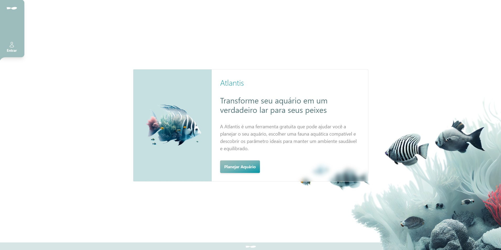

<h1 align="center"> ATLANTIS </h1>
<h3 align="center"> SISTEMA GERENCIADOR DE AQUÁRIOS DOMÉSTICOS </h3>



<p align="justify">Atlantis é um sistema web que utiliza a linguagem TypeScript, com o framework Next.js, que faz parte da biblioteca React.js, para o front-end, e o Node.js como um ambiente de execução server-side. Para persistência dos dados, foi utilizada a plataforma Supabase, com o SGBD PostgreSQL, e a no qual um expert na área de aquarismo possa estabelecer uma base de dados consistente, e assim, outra parte do sistema consiga prestar auxílio a um usuário que se interesse em montar aquários domésticos, de água doce ou salgada, informando-o se as espécies de peixes que deseja criar são compatíveis entre si e com as características do aquário.</p>

## ☁️ Acesso online

A aplicação está disponível online através do ambiente da Vercel, no seguinte endereço:

[https://atlantis-aquarium.vercel.app/](https://atlantis-aquarium.vercel.app/)


## 💻 Requisitos

Para executar a aplicação localmente, é necessário ter o `Node.js` e o `NPM` instalados na máquina.


## 🚀 Instalação

1 - Clone o repositório em sua máquina local:
```
git clone https://github.com/MarcosNespolo/atlantis.git
```

2 - Na pasta raiz do projeto, instale as dependências:
```
npm install
```

3 - Crie um arquivo .env.local na raiz do projeto com as variáveis de ambiente necessárias (enviadas por e-mail):
```
SUPABASE_URL=https://seu-endereco-do-supabase.supabase.co
SUPABASE_ANON_KEY=chave-publica-do-supabase
SUPABASE_API_KEY=chave-privada-do-supabase
```

4 - Execute a aplicação localmente:
```
npm run dev
```

5 - Acesse http://localhost:3000 em seu navegador para visualizar a aplicação.


## 🔧 Tecnologias utilizadas
- [x] Next.js
- [x] React.js
- [x] TypeScript
- [x] Tailwind
- [x] Supabase
- [x] PostgreSQL
- [x] HTML
- [x] CSS
